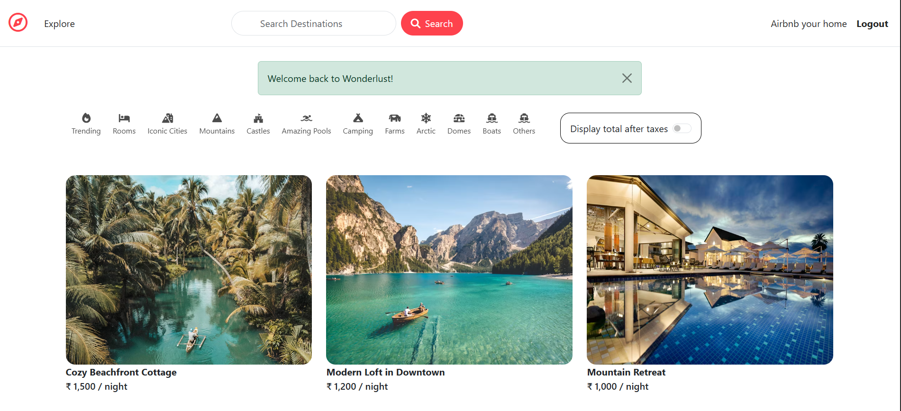
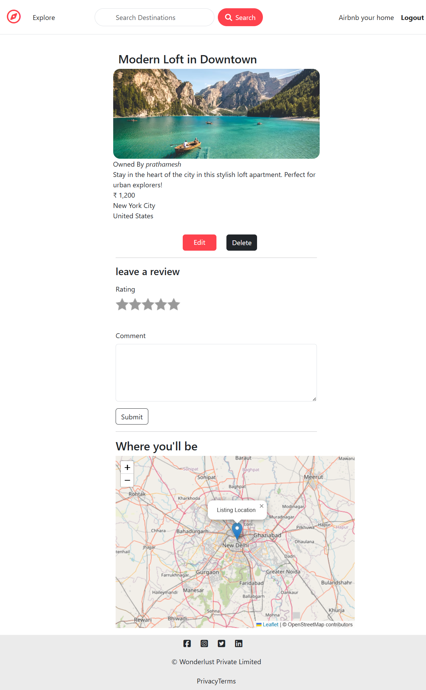
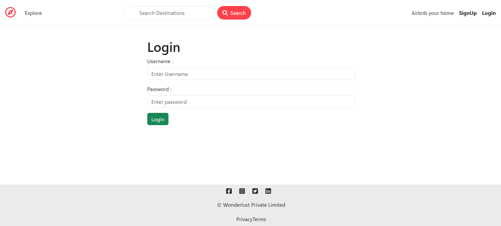
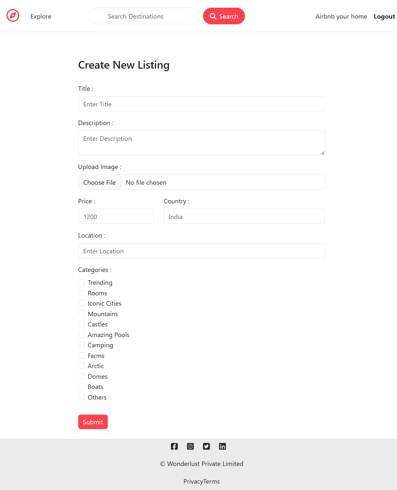

# Airbnb Clone

A full-stack Airbnb-inspired web application built using the MERN ecosystem. The platform enables users to explore property listings, create and manage listings, upload images, leave reviews, and securely authenticate using Passport.js. The application follows the MVC architecture and is deployed on Render with MongoDB Atlas for cloud database management.

## Live Demo

🔗 https://airbnb-project-451v.onrender.com

## Key Features

- Secure user authentication and authorization
- Create, update, and delete property listings
- Upload listing images with Cloudinary
- Add and manage property reviews
- Owner-based authorization for listings
- Responsive user interface
- RESTful architecture
- Server-side validation and error handling
- Flash messages for better user experience

---

## Tech Stack

### Frontend
- HTML5
- CSS3
- Bootstrap
- JavaScript
- EJS

### Backend
- Node.js
- Express.js

### Database
- MongoDB
- Mongoose

### Authentication
- Passport.js
- Express Session

### Cloud Services
- Cloudinary
- MongoDB Atlas

### Development Tools
- Git
- GitHub
- Render
- Postman
- VS Code

---

## Architecture

```
Client
   │
   ▼
Express Server
   │
Controllers
   │
Models (MongoDB)
   │
Cloudinary
```

The application follows the **MVC (Model–View–Controller)** architecture to maintain clean separation of concerns and improve scalability.

---

## Installation

### Clone Repository

```bash
git clone https://github.com/Prathamesh-rasal/Airbnb.git
```

### Navigate to Project

```bash
cd Airbnb
```

### Install Dependencies

```bash
npm install
```

### Configure Environment Variables

Create a `.env` file in the root directory.

```env
ATLASDB_URL=

SECRET=

CLOUD_NAME=

CLOUD_API_KEY=

CLOUD_API_SECRET=
```

### Run Project

```bash
npm start
```

The application will start on

```
http://localhost:3000
```

---

## Project Structure

```
airbnb-clone
│
├── controllers
├── middleware
├── models
├── public
├── routes
├── utils
├── views
├── app.js
├── package.json
└── README.md
```

---

## Future Enhancements

- Property Booking System
- Wishlist Functionality
- Payment Gateway Integration
- Google Maps Integration
- Search & Filter
- Booking Calendar
- User Profile Dashboard
- Admin Dashboard

---

## Screenshots

### Home Page



### Listing Details



### Login



### Create Listing



---

## Author

**Prathamesh Rasal**

GitHub: https://github.com/Prathamesh-rasal

LinkedIn: https://in.linkedin.com/in/prathamesh-rasal

---

## License

This project is developed for educational purposes and personal portfolio use.
